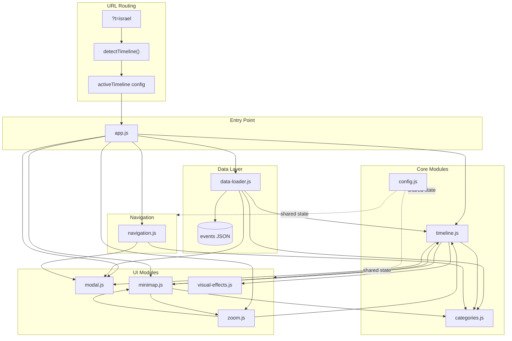

# AI Agent Guide

This guide is designed for AI agents working on this codebase. It provides a comprehensive overview of the project architecture, module responsibilities, data schema, and common modification patterns.

## Project Overview

**Interactive Timeline** is a horizontal timeline visualization tool for displaying historical events related to racism and anti-racism, created for a Tel Aviv University course. The app supports **multiple timeline variants** (e.g. Global, Israel) from a single codebase, switched via the `?t=` URL parameter.

### Tech Stack
- **Frontend**: Vanilla JavaScript, HTML5, CSS3
- **Backend**: Python HTTP server (for local development)
- **No build process**: Edit files directly and refresh browser

### Quick Start
```bash
python server.py
# Global timeline (default):  http://localhost:8888/index.html
# Israel timeline:            http://localhost:8888/index.html?t=israel
```

## Architecture Diagram



## JavaScript Module Reference

All modules share state through global variables (no ES modules). Script loading order in `index.html` matters.

### Loading Order
1. `config.js` - Must load first (defines shared state)
2. `visual-effects.js`
3. `categories.js`
4. `modal.js`
5. `timeline.js`
6. `minimap.js`
7. `zoom.js`
8. `navigation.js`
9. `data-loader.js`
10. `app.js` - Must load last (initializes everything)

---

### config.js - Configuration and State

**Purpose**: Central configuration, multi-timeline routing, shared state variables, and DOM element references.

**Multi-Timeline Routing**:
```javascript
TIMELINES              // Config map: { global: {...}, israel: {...} }
detectTimeline()       // Reads ?t= URL param, returns matching TIMELINES entry
activeTimeline         // The resolved config for the current page load
readColorPaletteFromCSS() // Reads --category-N-color CSS vars into an array
```

Each `TIMELINES` entry contains:
| Property | Description |
|----------|-------------|
| `eventsFile` | Path to the events JSON file |
| `infoFile` | Path to the info modal JSON file |
| `pageTitle` | Value set as `document.title` |
| `themeClass` | CSS class added to `<body>` (or `null` for default) |

**Key Constants**:
```javascript
yearWidth          // Current pixels per year (zoom level)
minYear, maxYear   // Timeline bounds (derived from events)
colorPalette       // Array of hex colors for categories (read from CSS vars at init)
maxLayers          // Maximum event lanes (default: 8)
maxZoomIn          // Maximum zoom level (200 px/year)
maxZoomOut         // Minimum zoom level (1 px/year)
```

**Key State Variables**:
```javascript
events             // Array of loaded event objects
categoryColors     // Map<string, string> - category name to color
hiddenCategories   // Set<string> - categories currently hidden
isZooming          // Boolean - prevents render during zoom
isInitialRender    // Boolean - first render flag
activeLayersCount  // Number - current lane count
```

**DOM References**:
```javascript
eventsLayer        // #eventsLayer - event blocks container
yearsLayer         // #yearsLayer - year labels container
reflectionLayer    // #reflectionLayer - visual effects layer
minimapCanvas      // Canvas element for minimap
minimapViewport    // Viewport indicator element
eventTooltip       // Tooltip element
categoriesMenu     // Category buttons container
```

**Utility Functions**:
- `reverseHebrewEnglishTitle(title)` - Fixes mixed RTL/LTR text display

---

### app.js - Entry Point

**Purpose**: Applies the active timeline configuration and initializes all event listeners and data loading.

**Key Function**:
```javascript
init()  // Main initialization - called on DOMContentLoaded
```

**Initializes** (in order):
1. Timeline-specific config: sets `document.title`, adds `themeClass` to `<body>`, reads `colorPalette` from CSS variables
2. Zoom button click handlers
3. Wheel zoom (`setupWheelZoom`)
4. Touch pinch zoom (`setupTouchZoom`)
5. Modal close/navigation handlers
6. Timeline drag-to-scroll (`setupTimelineDrag`)
7. Sticky titles on scroll (`setupStickyTitlesOnScroll`)
8. Minimap interactions (`setupMinimapInteractions`)
9. Browser history handling (`handlePopState`)
10. Data loading (`loadInfo`, `loadEvents`)

---

### data-loader.js - Data Fetching

**Purpose**: Fetches JSON data files and initializes the timeline.

**Key Functions**:
```javascript
loadInfo()              // Fetches info JSON for info modal
loadEvents()            // Fetches events JSON, processes categories, renders timeline
populateInfoModal()     // Populates info modal content from loaded data
updateInfoVideoDisplay()// Updates video display in info modal
```

**Data Source**: Determined at runtime by `activeTimeline.eventsFile` and `activeTimeline.infoFile` (configured in the `TIMELINES` map in `config.js`). No hardcoded file paths.

**To change data source for a timeline variant**: Edit the corresponding entry in the `TIMELINES` object in `config.js`.

---

### timeline.js - Core Rendering

**Purpose**: Renders the timeline: event blocks, year labels, lanes, and manages scroll behavior.

**Key Functions**:
```javascript
getTimelineWidth()                    // Calculates total timeline width in pixels
getTimelineScrollable()               // Returns scrollable container element
renderTimeline(scrollToEnd, centerYear) // Main render function
renderYearLabels()                    // Renders year labels with dynamic intervals
renderEvents()                        // Creates/positions event blocks in lanes
updateStickyEventTitles()             // Updates sticky title positions during scroll
setupTimelineDrag()                   // Enables drag-to-scroll
setupStickyTitlesOnScroll()           // Sets up scroll-based title behavior
getEventColor(event)                  // Returns event background color
```

**Lane System**: Events are placed in lanes (layers) to avoid overlap. `activeLayersCount` tracks current lane count.

**Event Block Structure**: Each event div has:
- `data-start-year`, `data-end-year` attributes
- `data-event-index` for modal navigation
- `.event-title` child for title display
- CSS `left` and `width` based on year position

---

### categories.js - Category System

**Purpose**: Manages category extraction, color mapping, filtering, and URL state.

**Key Functions**:
```javascript
deriveCategoriesFromDescriptions(event) // Extracts categories from event.descriptions keys
extractCategories()                     // Gets unique categories from all events
mapCategoriesToColors()                 // Assigns colors from palette to categories
renderCategoryButtons()                 // Creates filter buttons in UI
toggleCategoryVisibility(category)      // Toggles category show/hide
isEventVisible(event)                   // Returns true if event should be visible
readURLParams()                         // Reads ?hide= and ?event= from URL
updateURL()                             // Updates URL with current filter state
```

**Category Colors**: Assigned from `colorPalette` (populated from CSS variables `--category-N-color` at init). Categories without assigned colors use `defaultColor`.

---

### modal.js - Modal Functionality

**Purpose**: Manages info modal (about) and event detail modal.

**Key Functions**:
```javascript
// Info Modal
showInfoModal()         // Opens info/about modal
closeInfoModal()        // Closes info modal, stops video
playInfoVideo()         // Plays YouTube video in info modal

// Event Modal
showEventModal(event, options)    // Opens event detail modal
closeEventModal(skipHistoryUpdate)// Closes event modal
showPreviousEvent()               // Navigate to previous event
showNextEvent()                   // Navigate to next event
updateEventURL(eventIndex, options) // Updates URL with event index

// Utilities
extractYouTubeId(url)   // Extracts video ID from YouTube URL
clearModalVideos(container) // Removes video iframes
```

**Modal Elements**:
- `#infoModal` - Info/about modal
- `#eventModal` - Event detail modal with hero, videos, descriptions, links

---

### zoom.js - Zoom Controls

**Purpose**: Manages zoom levels, button states, and gesture-based zooming.

**Key Functions**:
```javascript
updateZoom(newYearWidth, options)  // Updates zoom with optional anchor point
zoomIn()                           // Zoom in to next level
zoomOut()                          // Zoom out to next level
zoomToMax()                        // Zoom to maximum detail
zoomToMin()                        // Zoom to minimum (overview)
setZoomButtonStates()              // Updates button disabled states
getCurrentZoomLevel()              // Gets closest predefined zoom level
getNextZoomLevel(direction)        // Gets next level in given direction
setupWheelZoom()                   // Sets up mouse wheel zoom
setupTouchZoom()                   // Sets up pinch-to-zoom
```

**Zoom Levels**: Discrete steps from `maxZoomOut` (1 px/year) to `maxZoomIn` (200 px/year).

---

### minimap.js - Minimap Navigation

**Purpose**: Renders overview canvas and handles minimap navigation.

**Key Functions**:
```javascript
refreshMinimap({ redraw })         // Refreshes minimap display
drawMinimap()                      // Draws events on canvas
updateMinimapViewport()            // Updates viewport indicator position/size
setupMinimapInteractions()         // Sets up click/drag/resize handlers
handleMinimapNavigation(clientX)   // Handles navigation clicks
resizeMinimapViewport(side, clientX) // Handles viewport edge dragging
highlightMinimapEvent(eventDiv)    // Highlights event on minimap
clearMinimapHighlight()            // Clears highlight
```

**Viewport Resizing**: Dragging viewport edges changes zoom level.

---

### visual-effects.js - Visual Helpers

**Purpose**: Manages tooltips and reflection effects.

**Key Functions**:
```javascript
showEventTooltip(eventData, targetElement, followCursor, cursorEvent, placement)
hideEventTooltip()
updateTooltipPosition(targetElement, cursorEvent)
buildTooltipHTML(event)            // Builds tooltip HTML content
showReflectionBlock(startYear, endYear, eventBackground, leftPosition, eventWidth)
hideReflectionBlock()
applyOpacityToBackground(background) // Adds opacity to colors/gradients
clampTooltipToViewport(padding)    // Keeps tooltip in viewport
```

---

### navigation.js - URL and History

**Purpose**: Handles browser navigation and error display.

**Key Functions**:
```javascript
displayError(message)   // Displays error in timeline container
handlePopState()        // Handles browser back/forward navigation
```

**URL Parameters**:
- `?t=israel` - Timeline variant selector (defaults to `global` if missing/invalid)
- `?hide=cat1,cat2` - Hidden categories (comma-separated)
- `?event=0` - Currently open event index

All URL-manipulation functions (`updateURL`, `updateEventURL`) preserve the `?t=` parameter automatically.

---

## CSS Architecture

### File Structure
`css/main.css` imports all component stylesheets in order:

| File | Purpose |
|------|---------|
| `base.css` | Reset, fonts, body layout, **category color CSS variables**, theme overrides |
| `brand.css` | Logo sticker and watermarks |
| `categories.css` | Category filter buttons |
| `controls.css` | Zoom control buttons |
| `events.css` | Event blocks and tooltips |
| `info-button.css` | Info button (top right) |
| `info-modal.css` | Info/about modal |
| `modal.css` | Event detail modal |
| `timeline.css` | Timeline container, minimap, scrollbar |
| `utilities.css` | Loading/error states |
| `years.css` | Year labels, timeline line, reflection |
| `mobile.css` | Mobile overrides (loaded last) |

### Z-Index Layers
```
2000+ : Modals (info, event)
1200  : Brand sticker, info button
1000  : Hovered events
100   : Sticky titles
10    : Normal events
1     : Timeline line, year labels
```

### Key CSS Patterns

**Parallelogram Shapes**:
```css
/* Event blocks use clip-path */
clip-path: polygon(15px 0%, 100% 0%, calc(100% - 15px) 100%, 0% 100%);

/* Category buttons use skew */
transform: skewX(-15deg);
```

**RTL Support**: Hebrew text uses `direction: rtl` throughout.

**Category Color Variables** (in `base.css`):
```css
:root {
    --category-1-color: #C36D53;
    --category-2-color: #66B973;
    /* ... up to --category-16-color */
}

.theme-israel {
    --category-1-color: #2563EB;
    --category-2-color: #DC2626;
    /* ... overrides for Israel palette */
}
```
These CSS variables are the source of truth for category colors. At init, `readColorPaletteFromCSS()` reads them into the JS `colorPalette` array. Theme classes (added to `<body>`) override the variables, so the JS code works identically for all variants.

**Responsive Breakpoints** (in `mobile.css`):
- Mobile: `< 768px`
- Tablet: `768px - 1024px`
- Desktop: `> 1024px`

---

## Data Schema

### Event Object
```json
{
  "title": "Event Title",
  "start_year": 1900,
  "end_year": 1950,
  "video_url": "https://youtube.com/watch?v=...",
  "image_url": "https://example.com/image.jpg",
  "links": [
    "https://example.com/resource1",
    "https://example.com/resource2"
  ],
  "descriptions": {
    "Category Name": "Description text for this category.",
    "Another Category": "Description from another angle."
  }
}
```

### Field Reference

| Field | Type | Required | Description |
|-------|------|----------|-------------|
| `title` | string | Yes | Event name displayed on timeline and modal |
| `start_year` | number | Yes | Starting year |
| `end_year` | number | Yes | Ending year (same as start for point events) |
| `video_url` | string | No | YouTube URL - embedded in modal |
| `image_url` | string | No | Hero image for modal and tooltip |
| `links` | string[] | No | URLs for "Further Reading" section |
| `descriptions` | object | No | Category name keys with description text values |

### Info Modal Data (per-variant `info.json`)

Each timeline variant has its own info file (configured via `TIMELINES[key].infoFile`):
- Global: `static/events-files/info.json`
- Israel: `static/events-files/israel-info.json`

```json
{
  "Section Title": "Section content text",
  "קישור לסרטון הסבר": "https://youtube.com/watch?v=..."
}
```
The key `קישור לסרטון הסבר` (Hebrew for "link to explanation video") triggers video embedding.

---

## Common Modification Patterns

### Adding a New Event Field

1. **Update data file(s)**: Add field to events in the relevant JSON file(s) under `static/events-files/` (e.g. `racism-events3.json` for Global, `israel-events.json` for Israel)

2. **Timeline display** (`js/timeline.js`):
   - Modify `renderEvents()` to read and display the field

3. **Modal display** (`js/modal.js`):
   - Modify `showEventModal()` to include field in modal HTML

4. **Tooltip** (`js/visual-effects.js`):
   - Modify `buildTooltipHTML()` to include field in tooltip

### Adding a New UI Control

1. **HTML** (`index.html`): Add button/element markup
2. **JavaScript**: 
   - Add DOM reference in `config.js`
   - Add click handler in `app.js` init or relevant module
3. **CSS**: Add styles in appropriate component file

### Modifying Event Appearance

1. **Shape/layout**: Edit `css/events.css` (`.event-block` class)
2. **Colors**: 
   - Category colors: CSS variables `--category-N-color` in `css/base.css` (`:root` for Global, `.theme-israel` for Israel)
   - Fallback color: `defaultColor` in `config.js`
3. **Entrance animation**: `@keyframes eventEntranceSlide` in `css/events.css`

### Changing Zoom Behavior

1. **Zoom limits**: `maxZoomIn`, `maxZoomOut` in `config.js`
2. **Zoom steps**: `zoomLevels` array in `zoom.js`
3. **Wheel/pinch sensitivity**: Adjust multipliers in `setupWheelZoom()`, `setupTouchZoom()`

### Modifying the Modal

1. **Layout**: `css/modal.css`
2. **Content**: `showEventModal()` in `js/modal.js`
3. **Navigation**: `showPreviousEvent()`, `showNextEvent()` in `js/modal.js`

### Adding Category Colors

Category colors are defined as CSS custom properties in `css/base.css`. To add or change colors:

1. **For all themes**: Update the `:root` block in `css/base.css`:
```css
:root {
    --category-1-color: #C36D53;
    /* ... */
    --category-17-color: #NEW_COLOR; /* add new slot */
}
```

2. **For a specific theme**: Override the variable in the theme class:
```css
.theme-israel {
    --category-17-color: #DIFFERENT_COLOR;
}
```

3. **Update the read limit**: If adding beyond 16 colors, increase the loop bound in `readColorPaletteFromCSS()` in `config.js`.

The JS `colorPalette` array in `config.js` serves as a fallback only; at init it is replaced by the CSS variable values.

### Adding a New Timeline Variant

1. **`config.js`**: Add an entry to the `TIMELINES` object with `eventsFile`, `infoFile`, `pageTitle`, and `themeClass`.
2. **Data files**: Create the corresponding JSON files in `static/events-files/`.
3. **CSS** (optional): If the variant needs its own color palette, add a new theme class in `css/base.css` that overrides the `--category-N-color` variables.
4. **Access**: Visit `index.html?t=<key>` where `<key>` matches the new `TIMELINES` key.

---

## File Modification Checklist

| Task | Files to Modify |
|------|-----------------|
| Event rendering | `timeline.js`, `events.css` |
| Event tooltip | `visual-effects.js`, `events.css` |
| Modal content | `modal.js`, `modal.css` |
| Modal layout | `modal.css`, `info-modal.css` |
| Zoom levels | `config.js`, `zoom.js` |
| Category system | `categories.js`, `categories.css`, `config.js` |
| Category colors | `base.css` (CSS variables), `config.js` (fallback array) |
| Minimap | `minimap.js`, `timeline.css` |
| Data loading | `data-loader.js`, `config.js` (`TIMELINES` paths) |
| Mobile styles | `mobile.css` |
| Year labels | `timeline.js`, `years.css` |
| URL parameters | `categories.js`, `navigation.js`, `modal.js` |
| Add timeline variant | `config.js` (`TIMELINES`), `base.css` (theme class), new JSON files |

---

## Key Files Quick Reference

| File | Lines | Purpose |
|------|-------|---------|
| `js/config.js` | ~170 | Configuration hub, multi-timeline routing - start here |
| `js/app.js` | ~67 | Entry point, applies timeline config |
| `js/timeline.js` | 832 | Core rendering logic |
| `js/modal.js` | ~300 | Modal functionality |
| `js/categories.js` | ~150 | Category system |
| `js/data-loader.js` | ~157 | Data fetching (uses `activeTimeline` paths) |
| `js/zoom.js` | ~200 | Zoom controls |
| `index.html` | 159 | Page structure, script loading |
| `css/base.css` | ~73 | Reset, fonts, **category color CSS variables**, theme overrides |
| `css/events.css` | 293 | Event block styles |
| `css/modal.css` | ~400 | Modal styles |
| `css/mobile.css` | 394 | Mobile overrides |

---

## Debugging Tips

1. **Wrong timeline loading**: Check `activeTimeline` in the console; verify `?t=` param in URL; confirm the key exists in `TIMELINES` in `config.js`
2. **Events not appearing**: Check `isEventVisible()` in `categories.js`, verify `hiddenCategories`
3. **Zoom not working**: Check `isZooming` flag in `config.js`
4. **Modal not opening**: Verify `data-event-index` attribute on event divs
5. **Minimap out of sync**: Call `refreshMinimap({ redraw: true })`
6. **Year labels wrong interval**: Check `yearLabelIntervalLevels` in `config.js`
7. **Category colors wrong**: Check `categoryColors` map, `colorPalette` array, and the `--category-N-color` CSS variables in `base.css`. If a theme class is active, inspect the `<body>` element to verify the overrides are applied
8. **Data not loading for a variant**: Verify the JSON file path in the `TIMELINES` entry matches an existing file in `static/events-files/`

---

## Global Scope Variables

Since this project uses global scope (no ES modules), these variables are accessible from any file loaded after they're defined:

```javascript
// From config.js
TIMELINES, activeTimeline               // Multi-timeline routing
detectTimeline(), readColorPaletteFromCSS()
yearWidth, minYear, maxYear, events
categoryColors, hiddenCategories, colorPalette, defaultColor
isZooming, isInitialRender, entranceAnimationInProgress
eventsLayer, yearsLayer, reflectionLayer, minimapCanvas
eventTooltip, categoriesMenu

// From categories.js
isEventVisible(event)

// From timeline.js
getTimelineWidth(), getTimelineScrollable()

// From zoom.js
updateZoom(), zoomIn(), zoomOut()

// From minimap.js
refreshMinimap(), highlightMinimapEvent(), clearMinimapHighlight()

// From modal.js
showEventModal(), closeEventModal(), showInfoModal(), closeInfoModal()
```
